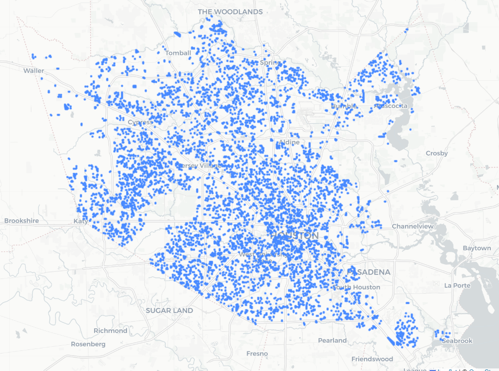

# HCAD_TAZ_METRO
Harris County Appraisal District Parcels within Houston Metro Service Area

### Executive Summary

Collecting and analyzing random samples of parcels to determine at any given selection: 

- [ ] Data about the parcel itself

- *Parcel Count Share between City of Houston vs other municipalities (incl unincorporated)*
- **spread of state class**, *land use code and building type*

- [x] Data about physical access to transit

- Distance to the nearest Transit Center
- Distance to the nearest commuter park and ride 
- Distance to the nearest LRT station

- [x] Data about physical barriers to transit 

- bridges within 1 mile radius
- railroad crossings within 1 mile radius
- *freeway within 1 mile radius*

## Step 1: Randomized Sample of Parcels 

Geometries within METRO Service Area

### Validating Randomized Samples

Independent Randomized Samples, initially set at 5, collected 500 at a time, filtering out records without geometry and skipping repeating. Each record is given a hex code, and the sample set is given an ID to prepare summaries.

Example: 

Collected 394 valid records (attempt 1)
Collected 807 valid records (attempt 2)
Collected 1210 valid records (attempt 3)

Collected 403 valid records (attempt 1)
Collected 802 valid records (attempt 2)
Collected 1220 valid records (attempt 3)

Collected 403 valid records (attempt 1)
Collected 806 valid records (attempt 2)
Collected 1217 valid records (attempt 3)

Collected 422 valid records (attempt 1)
Collected 829 valid records (attempt 2)
Collected 1242 valid records (attempt 3)

Collected 408 valid records (attempt 1)
Collected 804 valid records (attempt 2)
Collected 1198 valid records (attempt 3)

### Confidence in Sampling 

- [Link to wiki](https://github.com/kuromasadev/HCAD_TAZ_METRO/wiki/HCAD-METRO-Service-Area-Sampling)

## Step 2: Extracting Collected Account Numbers and Real Property Data

Notable Observations from test 5-set samples

### GIS and Real Property Datasets 

Currency Conversion Summary, due to mismatch:

appr_val: 12174 rows processed | 610 nulls filled | original type was float64

tot_appr_val: 12174 rows processed | 8 nulls filled | original type was object

mkt_val: 12174 rows processed | 610 nulls filled | original type was float64

tot_mkt_val: 12174 rows processed | 8 nulls filled | original type was object

### Column Mismatches 

Column Mismatches Found:

HCAD_NUM vs acct_clean: 8 records do not match (0.07% of total)

state_class_y vs state_class_x: 1162 records do not match (9.54% of total)

appr_val vs tot_appr_val: 14 records do not match (0.11% of total)

mkt_val vs tot_mkt_val: 14 records do not match (0.11% of total)

## Step 3: Transit Access Point Analysis 

Across the five sample sets, only three had "hits", meaning there was a transit center or park and ride within 1/4 mile. Less than 1% hits to a Park & Ride or Transit Center when considering random sampling of all parcels within the Service Area. This indicates that at a purely Euclidian perspective, there might be statistical significance to the distance between each parcel and the nearest transit access point. 

### One-Way ANOVA Across Access Types (Combined Samples) 

F-statistic: 5194.7828 

P-value: 0 → Significant difference in means between access types (p < 0.05) 

There is a statistically significant difference in mean distances among the access types (Transit Center, Park and Ride, LRT) — both overall and within each sample set. 

A Tukey post hoc analysis was conducted following a significant one-way ANOVA, revealing that mean distances to all transit access types statistically differ significantly from one another.

> **Observation**
>
> Park & Rides serve more peripheral areas, while LRT stations and Transit Centers tend to be located closer to developed urban cores or high-demand parcels.

#### Notes

\- Transit Centers are on average 8.76 miles closer than Park & Rides

\- LRT access is 15.39-mile average distance closer to properties than Transit Center

### Barriers to Accessibility Scatter

By exploring the correlation between barriers (railroad crossings and bridges) to access to transit centers or park and ride facilities, one can establish a validated hypothesis regarding the trend. 

> **Observation**
>
> Parcels farther from Park & Rides are slightly more likely to encounter more physical barriers
>
> Park & Ride facilities may be more likely placed near freeways or rail corridors, which already have higher bridge and railroad density.

#### Notes

\- Distance doesn't account for network impedance

\- The barrier count is within a fixed radius 

## Step 4: "Snapshot" generalization of the METRO Service Area
